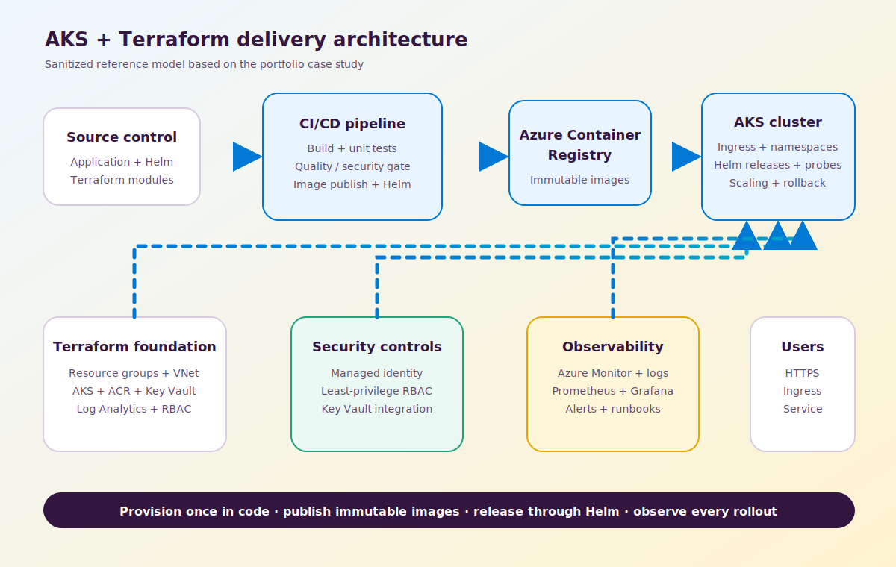

# AKS Platform Delivery With Terraform and Helm

This is a sanitized case study based on the professional project history in Ramakrishna Reddy Kandala's resume. Client names, private source code, credentials, subscription IDs, cluster names, and environment-specific values are intentionally excluded.

## Goal

Create a repeatable Azure platform and release process for containerized services:

- provision Azure networking, AKS, ACR, Key Vault, monitoring, and access controls as code
- publish immutable container images through a controlled pipeline
- deploy applications through reviewed Helm configuration
- avoid secrets in source control and pipeline variables
- provide health signals, alerts, dashboards, and rollback paths

## Architecture

## Delivery Flow

1. Terraform provisions the Azure foundation.
2. A build pipeline runs tests and quality or security gates.
3. The pipeline publishes an immutable image to ACR.
4. Helm promotes the approved image into the target AKS environment.
5. Readiness and liveness probes guard the rollout.
6. Azure Monitor, Prometheus, Grafana, and application telemetry verify health.
7. A failed release can be rolled back to the previous Helm revision.

## Main Challenges

### Configuration drift

Manual portal changes make environments difficult to compare and rebuild. The solution moves infrastructure into reviewed Terraform modules and release configuration into Helm values.

### Secret handling

Long-lived credentials in repositories or generic pipeline variables create avoidable risk. Managed identity, least-privilege RBAC, and Key Vault-backed secret delivery reduce that exposure.

### Release consistency

Different commands and values across environments lead to unstable releases. The delivery model uses one pipeline shape, immutable image tags, environment-specific Helm values, and explicit approvals.

### Operational ownership

A technically successful deployment is not production-ready without logs, metrics, alerts, dashboards, and a rollback procedure. Those controls are part of the delivery definition, not follow-up work.

## Security Decisions

- prefer managed identity over stored service credentials
- keep application secrets in Key Vault
- separate deployment and runtime permissions
- scope RBAC assignments to the smallest practical resource boundary
- scan and validate before publishing the image
- use namespace and environment separation
- keep public exposure behind controlled ingress
- audit deployment and access activity

## Reported Results

The resume reports:

- release turnaround reduced from hours to under 15 minutes
- improved reliability through zero-downtime deployment patterns
- repeatable AKS and Azure infrastructure delivery
- clearer monitoring and rollback paths

These outcomes are presented as resume-reported professional results. This repository provides the architecture and decision record, not confidential client source code.

## Related Reading

- [Deploying AKS with Terraform and Helm](../../articles/deploy-aks-terraform-helm.html)
- [Operating AKS with Azure Monitor and Grafana](../../articles/aks-observability-azure-monitor-grafana.html)
